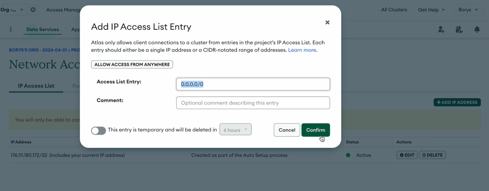

# Home Work 2 `nodejs-hw-mongodb`

**Крок 1**

Ініціалізуйте проєкт командою `npm init -y`

Додайте в залежності проєкта **eslint** та підкорегуй його конфігураційний файл згідно наданого прикладу в матеріалах **1го модуля** у блоці **“Файли налаштувань”.**

Додайте у корінь проєкта файли `.gitignore` та `.prettierrc` з відповідним вмістом.

Встановіть `nodemon` як залежність для розробки. Додайте скрипт **"dev"** у файл `package.json`, щоб запускати сервер за допомогою `nodemon`. Для цього відредагуйте розділ `scripts`.

**Крок 2**

Створіть в корні проєкта папку `src`.

В папці `src` створіть файл із назвою `server.js`. В ньому буде знаходитись логіка роботи вашого `express-серверу`.

В файлі `src/server.js` створіть функцію `setupServer`, в якій буде створюватись `express` сервер. Ця функція має в себе включати:

1. Створення серверу за допомогою виклику `express()`
2. Налаштування `cors` та логгера `pino`.
3. Обробку неіснуючих роутів (повертає статус **404** і відповідне повідомлення)
```js
{
  message: 'Not found',
}
```
4. Запуск серверу на порті, вказаному через змінну оточення **PORT** або **3000**, якщо такої змінної не зазначено
5. При вдалому запуску сервера виводити в консоль рядок **“Server is running on port {PORT}”**, де `{PORT}` - це номер вашого порта
6. Не забудьте вказати змінну оточення в файлі `.env.example`

Створіть файл `src/index.js`. Імпортуйте і викличте у ньому функцію **setupServer**.


**Крок 3**

Створіть свій кластер в **mongodb** та функцію **initMongoConnection** для встановлення зʼєднання з нею в окремому файлі `src/db/initMongoConnection.js`.


При створенні кластеру в **MongoDB Atlas**, не забудьте налаштувати доступ до мережі, щоб дозволити підключення з будь-якої IP-адреси. Для цього виконайте наступні кроки:

1. Увійдіть у свій обліковий запис **MongoDB Atlas **і перейдіть до свого проєкту.
2. Виберіть ваш кластер або створіть новий.
3. Перейдіть до розділу **"Network Access"**.
4. Додайте новий запис до списку IP-адрес натиснувши кнопку **"+ ADD IP ADDRESS"**.
5. У вікні, що з’явиться, виберіть **"ALLOW ACCESS FROM ANYWHERE"** або введіть **0.0.0.0/0** в поле **"Access List Entry"**. Це дозволить підключення до вашого кластеру з будь-якої IP-адреси.
За потреби додайте коментар, потім натисніть **"Confirm"**.



При вдалому підключенні до вашої базі в **mongodb** виводьте в консоль рядок **"Mongo connection successfully established!"**.

Дані для підключення до бази мають бути винесені в наступні змінні оточення:
```js
MONGODB_USER
MONGODB_PASSWORD
MONGODB_URL
MONGODB_DB
```
Вкажіть ці змінні оточення в файлі `.env.example`

Для роботи з **mongodb** використовуйте пакет **mongoose**.

У файлі `src/index.js` викличте функції **initMongoConnection**. Переконайтеся, що зʼєднання із базою встановлюється до запуску серверу.

**Крок 4**

- **name** - string, required
- **phoneNumber** - string, required
- **email** - email, optional
- **isFavourite** - boolean, default false
- **contactType** - string, enum(’work’, ‘home’, ‘personal’), required, - default ‘personal’

Для автоматичного створення полів **createdAt** та **updatedAt**, можна використати параметр `timestamps: true` при створенні моделі. Це додає до об'єкту два поля: **createdAt** (дата створення) та **updatedAt** (дата оновлення), і їх не потрібно додавати вручну.

[contacts.json](https://drive.google.com/file/d/1oTu7HLIViJ5-X4QjzEEOFJoDjbK5vk_J/view)
Імпортуйте базовий набір контактів із файлу `contacts.json` до вашої бази, користуючись будь-яким UI інтерфейсом (в браузері, **Mongo Compass** тощо). Переконайтеся, що назва колекції в коді моделі та в візуальному інтерфейсі співпадають.

**Крок 5**

Створіть роут **GET** `/contacts`, який буде повертати масив усіх контактів. Обробка цього роута має включати:

1. Реєстрацію роута в файлі `src/server.js`
2. Опис контролера для цього роута
3. Створення сервісу в папці `src/services` у файлі із відповідним сутності іменем(в данному випадку `contacts.js`)
4. Відповідь сервера має містити об’єкт з наступними властивостями:
**status** — статус відповіді
**message** — повідомлення про результат виконання операції `"Successfully found contacts!"`
**data** — дані, отримані в результаті обробки запиту

**Крок 6**

Створіть роут **GET** `/contacts/:contactId`, який буде повертати дані контакту за переданим **ID** або повертати помилку **404**, якщо контакт не знайдено. Обробка цього роута має включати:

1. Реєстрацію роута в файлі `src/server.js`
2. Опис контролера для цього роута
3. Створення сервісу в папці `src/services` у файлі з відповідним іменем сутності (в даному випадку `contacts.js`)
4. Відповідь сервера, якщо контакт було знайдено, має бути зі статусом **200** та містити об’єкт з наступними властивостями:

```json
{
	status: 200,
	message: "Successfully found contact with id {**contactId**}!",
	data:
		// об'єкт контакту
}
```
Додайте перевірку чи контакт за переданим ідентифікатором було знайдено. Якщо контакт не було знайдено, то поверніть відповідь зі сатусом **404** і наступним об’єктом:

```json
{
	message: 'Contact not found',
}
```

!!! > На даному етапі не потрібно перевіряти невалідний MongoDB ID у цьому модулі. Припускаємо, що ID завжди валідний

**Крок 7**

Задеплойте ваш додаток з гілки **hw2-mongodb** на [render.com](https://render.com/). Покрокова інструкція як це зробити є в цьому відео:

!VIDEO

!!! > Дуже важливо перед здачею дз на перевірку ментору перевіряти роботу вашого задеплоєного додатка на render.com! Якщо, наприклад, при деплої ви забули додати змінні оточення (env), то задеплоєний бекенд не буде працювати. Також перевірте, що всі створені вами маршрути бекенду працюють як очікується згідно з завданням.
